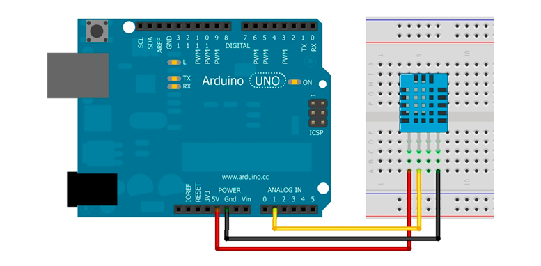

# Data Logger Arduino using PostgreSQL Database

In this project we created a data logger using an Arduino board to store
temperature and humidity from soil and ar into a database on localhost.

## Hardware

Montagem:

## Instalando a biblioteca no Python 2 (parte relacional com PostgreSQL)
No seu terminal, digite:
* **psycopg2**: `$ sudo apt-get install psycopg2`
* **pyserial**: `$ pip  install pyserial`

## Instalando bibliotecas para Python 3 (parte não-relacional com MongoDB)
* **pymongo**: `$ pip  install pymongo`
* **pyserial**: `$ pip  install pyserial`

## Requisitos para funcoinamento do programa
Para executar o programa, tenha certeza que os serviços do MongoDB foram inicializados
* `$ sudo service mongod start`
* `$ mongo start`

Para que o programa funcione corretamente:
* No banco de dados relacional crie as suas tabelas a partir do arquivo `docs\sql\codSQL.sql`.
* No banco de dados não-relacional, execute o arquivo `MongoDB\py\conf.py` no seu terminal:

  `$ python3 conf.py`

## Programando Arduino com o Atom

1. Instale o pacote `platomformio` no atom (Edit -> Preferences -> Install).
1. Instale o pacote Python para comunicação:
 `$ pip  install platformio`
1. Na pasta onde ficará o código rode: `platformio init --board=uno`
1. Na pasta **src** criada coloque seu código **.ino**.
1. Para usar os comandos use o atalho **Ctrl+Shift+P** no atom e digite: **platomformio**. Os comandos mais utilizados são o build (compilar) e o upload (compilar e carregar).
1. Para visualizar a porta serial utilize um terminal e o comando: `platformio device monitor --baud=9600`

## Protocolo de comunicação entre o Arduino e o Computador
 A comunicação foi feita através da porta serial com baudrate de 9600.

* **Arduino -> Computador**

Pacotes:

  Tipo | Informação | Finalizador
  ---- | ---------- | -----------
  'U' | '29' | '\r\n'
  'T' | '25.0' | '\r\n'

Sendo 'U' o indicador que será enviado um valor de Umidade (porcentagem).
E 'T' o indicador que será enviado um valor de Temperatura (graus celcius).

* **Computador -> Arduino**

O Computador envia comandos para o Arduino. São eles:

CMD | Descrição
--- | ---------
'R' | Ler os sensores
'U' | Ligar o irrigador
'u' | Desligar o irrigador
'T' | Ligar um ventilador
't' | Desligar o irrigador

## Group components
- Pablo Nunes
- Paulo Camargos
- Thiago Pereira de Oliveira

Colaborations: Ítalo Fernandes - github.com/italogfernandes
